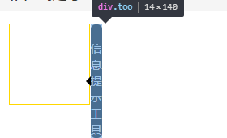
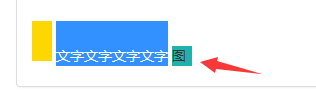

# CSS中的绝对定位

## 绝对定位元素的宽度计算

绝对定位\(absolute\)与固定定位\(fixed\)元素**具有包裹性**。宽度是由内容撑开，而它的最大自适应宽度则是 **最近的定位属性为非static的父级元素** 的宽度减去定位元素的left或right的剩余宽度。

如图：

改变left值时：

添加white-space: nowrap; 样式或固定宽度可让定位元素宽度符合预期。

## 没有定位值时的表现状态

当元素设置absolute定位，但不设置任何偏移属性时。元素相对于**行框顶部**对齐

如图所示：

