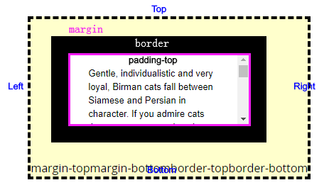

# gitBook 支持的特性示例

排版相关

## 一级标题

### 二级标题

#### 三级标题  （最多只支持到三级标题）


**段落**：我是段落内容我是段落内容我是段落内容我是段落内容我是段落内容我是段落内容我是段落内容我是段落内容我是段落内容我是段落内容我是段落内容我是段落内容我是段落内容我是段落内容我是段落内容我是段落内容我是段落内容我是段落内容我是段落内容我是段落内容我是段落内容我是段落内容我是段落内容我是段落内容我是段落内容我是段落内容我是段落内容

**无序列表**：

* 我是无序列表item1
* 我是无序列表item2
* 我是无序列表item3
  * 我是二级无序列表item1，我可以通过一级无序列表tab得到

有序列表：

1. 我是有序列表1
2. 我是有序列表2
3. 我可以通过1. 开头来得到

任务列表：

* [ ] 我是任务列表1
* [ ] 我是任务列表2

代码示例：



```javascript
var m1 = new Vue({
    el:'#m1',
    data:{
        a:'hello Vue',
        b:'good job'
    },
    method:{
        /* you can define some function here*/
    }
});
```



引用示例：

> ### 我是引用的内容哦；我是引用的内容哦
>
> 我是引用的内容哦

图片示例：图片默认只能居中显示，且只能是块状显示，不能行内显示（后续版本会改进行内显示）



表格示例：（remove 操作时要注意会删掉整个表格）

| 表格头 | 表格头 | 表格头 |
| --- | --- | --- | --- | --- |
|  |  |  |
|  |  |  |
|  |  |  |
|  |  |  |

Hint 示例：（提示示例4种）


建议



注意



warning



推荐


页面链接示例：




API 示例：



获取宠物信息列表  







































```

```







```

```







```

```







```

```







```

```







```

```





table切换示例：



first tab contents



second tab conten




